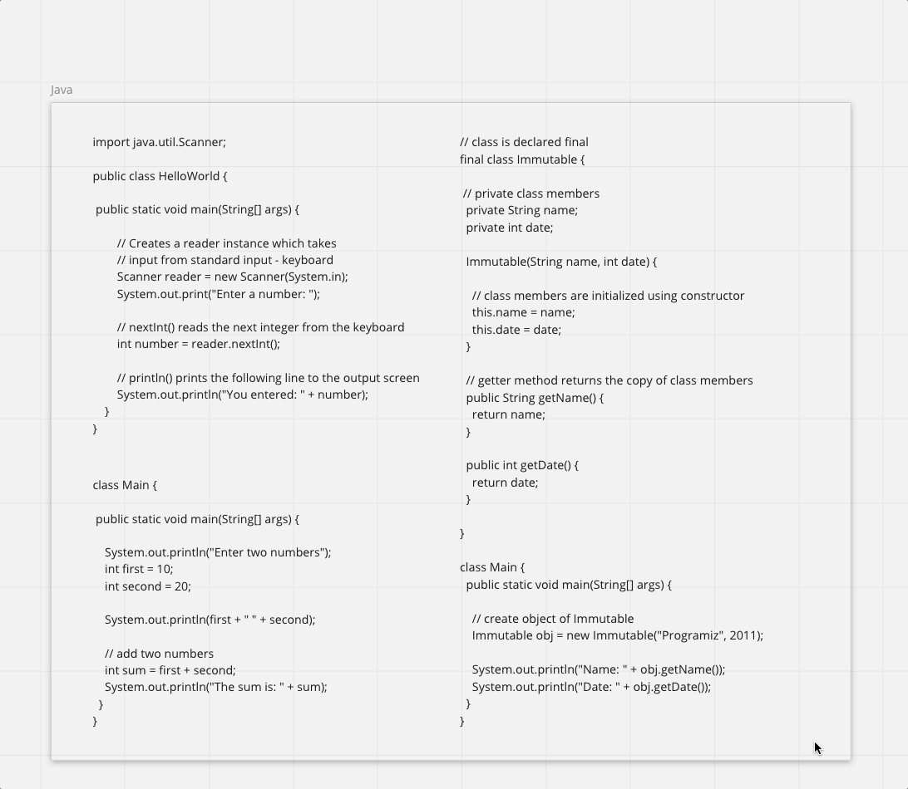
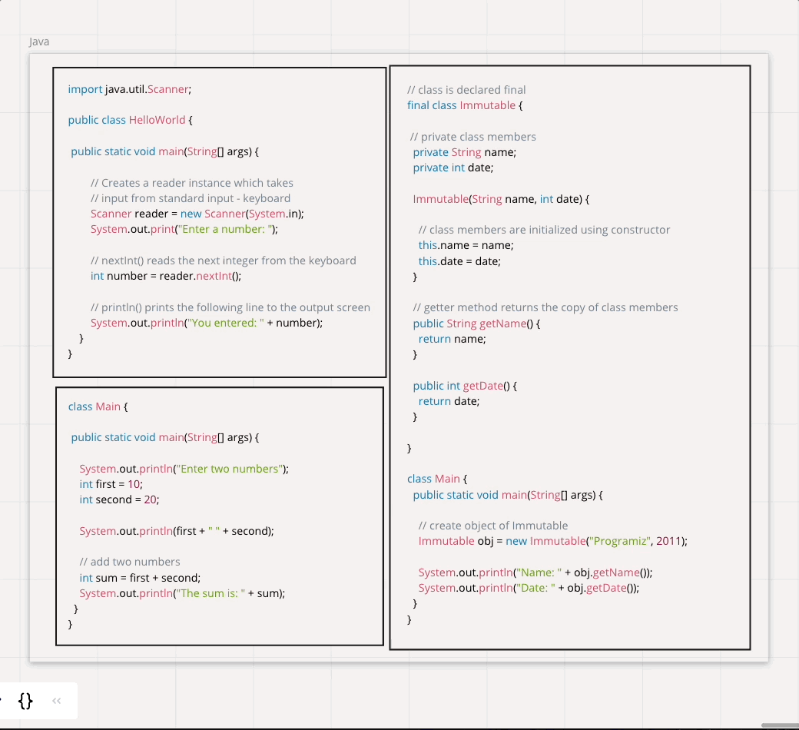
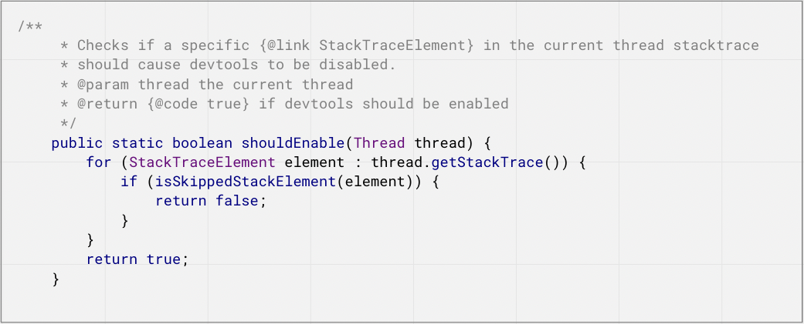
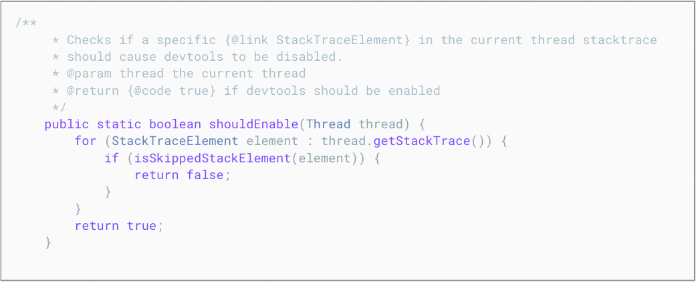
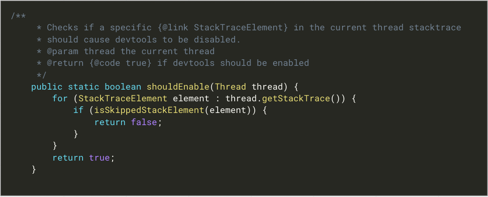
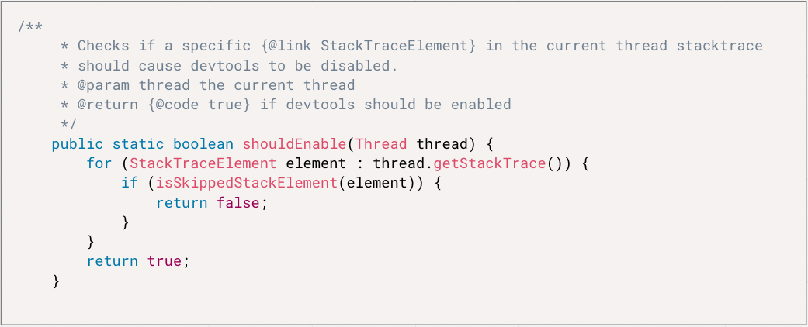
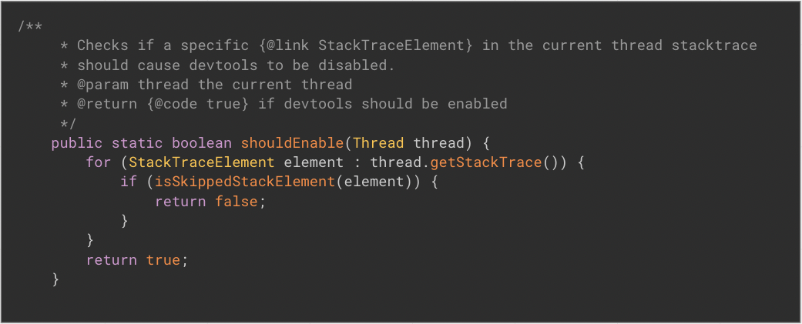
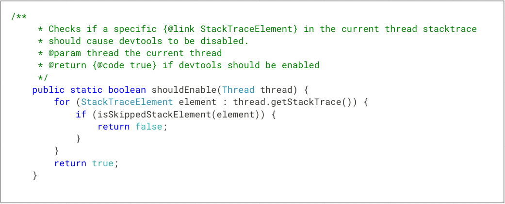

## Code syntax highlighter plugin for Miro
The plugin can colorize the text according to the selected programming language in shape/text widgets.

<a target="_blank" href="https://miro.com/oauth/authorize/?response_type=code&client_id=3074457347020676712&redirect_uri=%2Fconfirm-app-install%2F">
Installation link miro.com
</a>

### Highlighting


### Widget menu configuration


### List of supported languages
- c#
- gherkin
- java
- javascript
- json
- typescript

### Themes

#### Light Transparent (idea)


#### Material Light


#### Okaidia


#### Prism


#### Tomorrow Night


#### VS Code


## Development

### Debug locally

```shell
npm run watch       # build plugin
http-server ./dist/ # install with npm https-server for easy serving files
ngrok http 8080     # get public https link and set it to dev plugin in miro
```

### Deployment

All the plugin static files, which are being built by `webpack`, are located under the `dist`
directory and published and served by `glitch.com`: https://miro-code-highlighter.glitch.me/install.html,
`dist/*` files are available under `https://miro-code-highlighter.glitch.me/*`

## FAQ/Problems

### Security / Data Sharing
All the transformations happen on the client-side at the user browser (user) session.

#### Troubleshooting data
The plugin collects errors and their stack traces and sends them to `sentry.io` for improvement purposes, no user data is being collected.

E.g. in case of text limit error, message like `Highlighted length: 7019 Cleaned length: 2490 Widget text length: 3012` is being sent to `sentry`.

[Additional data which is being collected by sentry](https://docs.sentry.io/platforms/javascript/data-management/sensitive-data/), such as: `ip address`, `user-agent`.